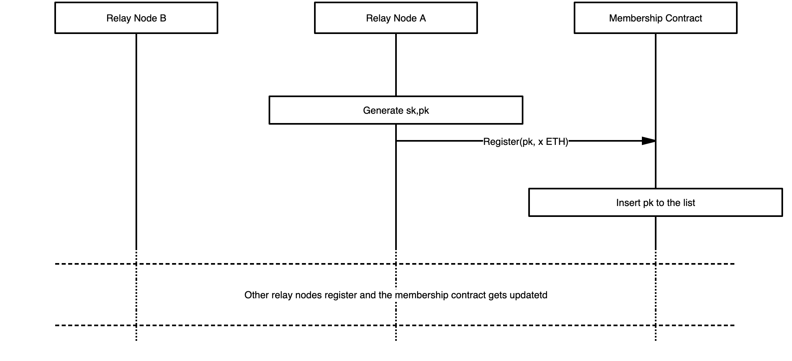
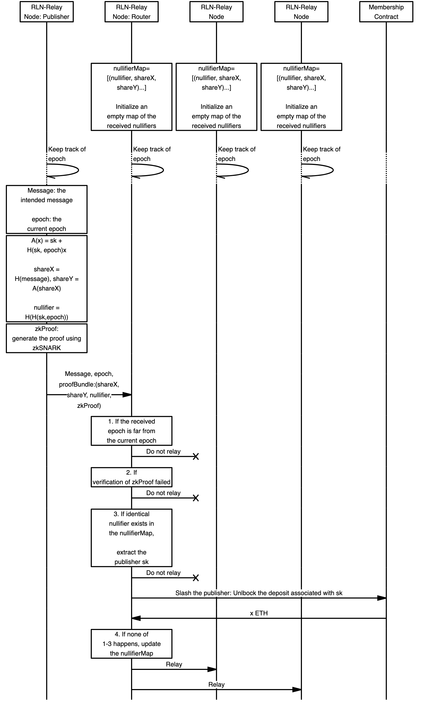

# Introduction

This blog is going to give you an overview of how we enabled spam protection in waku relay through rate-limiting nullifiers or rln for short.

Firstly, let me give a little background about Waku. Waku is a privacy-preserving peer-to-peer (p2p) messaging protocol for resource restricted devices. Being p2p means that Waku relies on **No** central server, instead messages get transmitted in the network by users' (i.e., peers) collaboration. The underlying protocol (as the writeup of this blog) is [GossipSub](https://docs.libp2p.io/concepts/publish-subscribe/). In a very informal way, the message transmission in GossipSub is like I send a message to you, you send it to whoever you know, and it goes on till the message reaches its destination. 

## Spam Definition
What does spamming stand for? In a messaging system, spam and spammer can have multiple definitions depending on context e.g., spam can be merely an unsolicited message, or spamming may mean sending an unsolicited message (spam) to large numbers of recipients (in which a large number of the recipients is emphasized). However, in a decentralized p2p system (in specific a p2p system with a GossipSub routing structure), the problem of spamming goes beyond just the recipients of a message and it affects all the peers. This is because the spam messages get routed through the collaboration of all the peers thus consume the resources of the intermediate peers; the system gets congested, and the availability of peers degrades as they get busy spending their computational power/bandwidth/storage capacity on processing spam messages.  

Following the preceding argument, we define a spammer as an entity who uses the messaging system (regardless of the intention) to publish a large number of messages (regardless of the content and the number of recipients) in a short amount of time. The messages issued in this way are called spam. 

## Related Solutions

Has the spamming issue addressed before? Of course yes! Here is an overview of the spam protection techniques with their trade-offs and use-cases:

### Centralized Messaging Systems
In traditional centralized messaging systems e.g., mail servers, spam usually signifies unsolicited messages sent in bulk or messages with malicious content like malware. Protection mechanisms include (but are not limited to) authentication through some piece of personal information e.g., phone number, checksum-based filtering (to protect against messages sent in bulk), challenge-response systems, and content filtering (on the server or via a proxy application). These methods exploit the fact that the messaging system is centralized and a global view of the users' activities is available based on which spamming patterns can be extracted and defeated accordingly.  Moreover, users are associated with an identifier (username) which enables the server to profile each user (to detect suspicious behavior like spamming) which is against the user's anonymity and privacy. 

### P2P Systems
But what about spam prevention in p2p messaging platforms?  
there is the *Proof of Work* technique deployed by Whisper and *Peer scoring* method (namely reputation-based approach) adopted by LibP2P, but each of these solutions has its own shortcomings for real-life use-cases. 

#### Proof of work
The idea behind the proof of work is to make messaging a computationally costly operation hence lowering the messaging rate of **all** the peers including the spammers. This solution does not suit heterogeneous systems with resource-restricted peers who won't be able to carry the designated computation and will be practically excluded from the system. 

#### Peer Scoring
The peer scoring method is to limit the number of messages issued by a peer in connection to another peer. That is each peer monitors all the peers to which it is directly connected and adjusts their messaging quota (i.e., to route or not route their messages) depending on their past activities. e.g., if a peer detects its neighbor is sending more than x messages per month, can drop its quota to z.x where z is less than one (this is only one sample strategy).  One shortcoming of this solution is that scoring is based on peers' local observations and the concept of the score is defined in relation to one single peer. This leaves room for an attack where an attacker can make connections to k peers in the system and publishes k.(x-1)  messages by exploiting all of its k connections. Another attack scenario is through botnets consisting of a large number of (e.g., a million) bots. The attacker rents a botnet and inserts each of them as a legitimate peer to the network and each can publish x-1 messages per month without being identified as a spammer. <!-- Another downside is the possibility of false-positive, where the attacker can surround one single peer with some spam peers and make him look like a spammer and cause him to get removed by its neighbors. It also exhibits issues around privacy as well as arbitrary exclusion. -->

#### Economic-Incentive Spam protection
But, is it the end of the spam-protection journey!? shall we get along with the spammers! Certainly not, Waku is here to save you!
We brought you a p2p spam-protection method which:
- is **efficient**  and fits the  network of **heterogeneous** peers (i.e., no crazy computational, storage, memory, and bandwidth requirement!). 
- respects users privacy (unlike reputation-based and centralized methods)
- deploys economic-incentives to contain spammers' activity. Namely, there is a financial sacrifice for those who want to spam the system. How? follow along ...

We devise a general rule to save everyone's life and that is 

**No one can publish more than N messages per epoch without being financially charged!** 

We set N to 1 for now, but keep in mind, it can be any arbitrary value.
You may be thinking that it is too restrictive! one per epoch!? but don't worry, we set the epoch to a reasonable value so that it does not slow down the communication of innocent users but will make the life of spammers harder! Epoch here can be every second, as defined by UTC date-time +-20s.

The remainder of this blog is all about the story of how to enforce this limit on each user's messaging rate as well as how to impose the financial cost when the limit gets violated.  This brings us to the Rate Limiting Nullifiers and how we integrate this technique into Waku v2 (in specific the `WakuRelay` protocol) to protect our valuable users against spammers.

<!-- TODO maybe some # Technical Terms -->

# Overview: Economic-Incentive Spam protection through Rate Limiting Nullifiers

The following are the foundational components of Economic-incentive spam protection:

- 1- **Group**: We manage all the peers inside a large group (later we can split peers into smaller groups, but for now consider only one). The group management is done via a smart contract which is devised for this purpose and is deployed on the Ethereum blockchain.
- 2- **Membership**: To be able to send messages and in specific for the published messages to get routed by all the peers, publishing peers have to register to the group. Membership involves setting up public and private key pairs (think of it as the username and password). The private key remains at the user side but the public key becomes a part of the group information on the contract (publicly available) and everyone has access to it. Public keys are not human-generated (like usernames) and instead they are random numbers, as such, they do not reveal any information about the owner (think of public keys as pseudonyms). Registration is mandatory for the users who want to publish a message, however, users who only want to listen to the messages are more than welcome and do not have to register in the group. 
- **Membership fee**: Membership is not for free! each peer has to lock a certain amount of funds during the registration (this means peers have to have an Ethereum account with sufficient balance for this sake). This fund is safely stored on the contract and remains intact unless the peer attempts to break the rules and publish more than one message per epoch. 
- **Zero-knowledge Proof of membership**: Do you want your message to get routed to its destination, fine, but you have to prove that you are a member of the group (sorry, no one can escape the registration phase!). Now, you may be thinking that should I attach my public key to my message to prove my membership? Absolutely Not! we said that our solution respects privacy! membership proofs are done in a zero-knowledge manner that is each message will carry cryptographic proof asserting that "the message is generated by one of the current members of the group", so your identity remains private and your anonymity is preserved!
- **Slashing through secret sharing**: Till now it does not seem like we can catch spammers, right? yes, you are right! now comes the exciting part, detecting spammers and slashing them. The core idea behind the slashing is that each publishing peer (not routing peers!) has to integrate a secret share of its private key inside the message. The secret share is deterministically computed over the private key and the current epoch. The content of this share is harmless for the peer's privacy (it looks random) unless the peer attempts to publish more than one message in the same epoch hence disclosing more than one secret share of its private key. Indeed two distinct shares of the private key under the same epoch are enough to reconstruct the entire private key. Then what should you do with the recovered private key? hurry up! go to the contract and withdraw the private key and claim its fund and get rich!! Are you thinking what if spammers attach junk values instead of valid secret shares? Of course, that wouldn't be cool! so, there is a zero-knowledge proof for this sake as well where the publishing peer has to prove that the secret shares are generated correctly.

# Flow 
In this section, we describe the flow of our economic-incentive spam detection mechanism from the viewpoint of a single peer. An overview of this flow is provided in Figure 2.

## SetUp and Registration
A peer willing to publish a message is required to register. Registration is moderated through a smart contract deployed on the Ethereum blockchain. The state of the contract contains the list of registered members' public keys. An overview of registration is illustrated in Figure 1.

For the registration, a peer creates a transaction that sends x amount of Ether to the contract. The peer who has the "private key" `sk` associated with that deposit would be able to withdraw x Ether by providing valid proof. Note that  `sk` is initially only known by the owning peer however it may get exposed to other peers in case the owner attempts spamming the system i.e., sending more than one message per epoch.
The following relation holds between the `sk` and `pk` i.e., `pk=h(sk)` where `h` denotes a hash function.

<!-- diagram -->

    
     
    Figure 1: Registration.

## Maintaining membership Merkle Tree
The ZKP of membership that we mentioned before relies on the representation of the entire group as a [Merkle Tree](). The tree construction and maintenance is delegated to the peers (the initial idea was to keep the tree on the chain as part of the contract, however, the cost associated with member deletion and insertion was high and unreasonable, please see [Feasibility and Open Issues](#Feasibility-and-Open-Issues) for more details). As such, each peer needs to build the tree locally and sync itself with the contract updates (peer insertion and deletion) to mirror them on its tree.
Two pieces of information of the tree are important as they enable peers to generate zero-knowledge proofs. One is the root of the tree and the other is the membership proof (or the authentication path). The tree root is public information whereas the membership proof is private data (or more precisely the index of the peer in the tree). 

## Publishing

In order to publish at a given epoch, each message must carry a proof i.e., a zero-knowledge proof signifying that the publishing peer is a  registered member, and has not exceeded the messaging rate at the given epoch. 

Recall that the enforcement of the messaging rate was through associating a secret shared version of the peer's `sk` into the message together with a ZKP that the secret shares are constructed correctly. As for the secret sharing part, the peer generates the following data:
1. `shareX`
2. `shareY`
3. `nullifier`

The pair (`shareX`, `shareY`)  is the secret shared version of `sk`. Having two such pairs for an identical `nullifier` results in full disclosure of peer's `sk` and hence burning the associated deposit. Note that the `nullifier` is a deterministic value derived from `sk` and `epoch` therefore any two messages issued by the same peer (i.e., using the same `sk`) for the same `epoch` are guaranteed to have identical `nullifier`s.

Finally, the peer generates a zero-knowledge proof  `zkProof`  asserting the membership of the peer in the group and the correctness of the attached secret share (`shareX`, `shareY`) and `nullifier`. In order to generate a valid proof, the peer needs to have its `sk`, its authentication path, the tree root, epoch, and obviously the content of the message.

**Privacy Hint:** Note that the authentication path of each peer depends on the recent list of members (hence changes when new peers register or leave). As such, it is recommended (and necessary for privacy/anonymity) that the publisher updates her authentication path based on the latest status of the group and attempts the proof using the updated version.

An overview of the publishing procedure is provided in Figure 2.

## Routing

Upon the receipt of a message, the routing peer needs to decide whether to route it or not. This decision relies on the following factors:
1- If the epoch value attached to the message has a non-reasonable gap with the routing peer's current epoch then the message must be dropped (this is to prevent a newly registered peer spamming the system by messaging for all the past epochs). 
2- The message MUST contain valid proof that gets verified by the routing peer. 
If the preceding checks are passed successfully, then the message is relayed. In case of an invalid proof, the message is dropped. If spamming is detected, the publishing peer gets slashed (see [Spam Detection and Slashing](#Spam-Detection-and-Slashing)). 

An overview of the routing procedure is provided in Figure 2.

### Spam Detection and Slashing
In order to enable local spam detection and slashing, routing peers MUST record the `nullifier`, `shareX`, and `shareY` of any incoming message conditioned that it is not spam and has a valid proof. To do so, the peer should follow the following steps. 
1. The routing peer first verifies the `zkProof` and drops the message if not verified. 
2. Otherwise, it checks whether a message with an identical `nullifier` has already been relayed. 
   1. If such message exists and its `shareX` and `shareY` components are different from the incoming message, then slashing takes place (if the `shareX` and `shareY` fields of the previously relayed message is identical to the incoming message, then the message is a duplicate and shall be dropped).
   2. If none found, then the message gets relayed.

An overview of the slashing procedure is provided in Figure 2.

    
     
    Figure 2: Publishing, Routing and Slashing workflow.

# Feasibility and Open Issues

## Storage overhead per peer
Currently, peers are supposed to maintain the entire tree locally and it imposes storage overhead which is linear in the size of the group (see this [issue](https://github.com/vacp2p/research/issues/57) for more details). One way to cope with this is to use the light-node and full-node paradigm in which only a subset of peers who are more resourceful retain the tree whereas the light nodes obtain the necessary information by interacting with the full nodes <!--what about the anonymity issue-->. Another way to approach this problem is through a more storage efficient method (as described in this [research issue](https://github.com/vacp2p/research/pull/54)) where peers store a partial view of the tree (instead of the entire tree) which lowers the storage complexity to O(log(N)) where N is the size of the group. There are still unknown unknowns to this solution, as such, it must be studied further to become fully functional.

## Cost-effective way of member insertion and deletion
Currently, the cost associated with rln-relay membership is around 30 USD (a detailed calculation of this cost is given in this [issue](https://github.com/vacp2p/research/issues/56)). We aim at finding a more cost-effective approach. Please feel free to share with us your solution ideas in this regard in this [issue](https://github.com/vacp2p/research/issues/56). 

## Exceeding the messaging rate via multiple registrations
While the economic-incentive solution has an economic incentive to discourage spamming, we should note that there is still **Expensive attack(s)** that a spammer can launch to break the messaging rate limit. That is, the attacker can pay for multiple legit registrations e.g., k, hence being able to publish k messages per epoch. We believe that the higher the membership fee is, the less probable would be such an attack, hence a stronger level of spam-protection can be achieved. Following this argument, the high fee associated with the membership (which we listed above as an open problem) can indeed be contributing to a better protection level.  

# Acknowledgement
Thanks to Onur Kılıç for his explanation and pointers and for helping with development and runtime issues. Also thanks to Barry Whitehat for his time and insightful comments. 

# References
- RLN-Relay specifications: https://github.com/vacp2p/vacp2p.github.io/blob/rln-relay/_posts/2021-02-19-26-rln-relay.md
- RLN documentation: https://hackmd.io/tMTLMYmTR5eynw2lwK9n1w?both
- RLN repository: https://github.com/kilic/rln
- Peer scoring security issues: https://github.com/vacp2p/research/issues/44

<!-- TODO -check if N is always used with the same definition-->
<!-- TODO Maybe talk about the requirements, run time, etc.>
<!-- TODO add merkle tree update to the registration fig>
<!-- TODO details about the zero-knowledge system groth16>