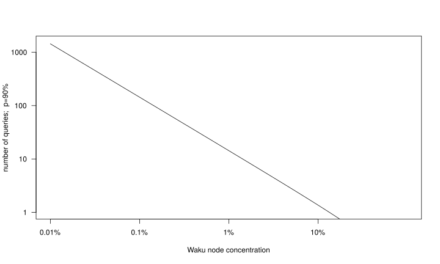

As covered in previous posts on this research log, Waku v2 builds on [libp2p gossipsub](https://github.com/libp2p/specs/blob/10712c55ab309086a52eec7d25f294df4fa96528/pubsub/gossipsub/README.md).
Nodes participating in a gossipsub protocol manage a mesh network that is used for routing messages.
This mesh network is managed in a decentralized way, which requires each node to know other participating peers.
A node learns about the existence of other peers via [*ambient peer discovery*](https://docs.libp2p.io/concepts/publish-subscribe/#discovery).
Ambient peer discovery is an umbrella term for mechanisms that allow nodes to find other peers.
It is an integral part of any decentralized application.

Waku v2 comprises a *peer management layer* based on libp2p gossipsub, which manages the peers of nodes, and an *ambient peer discovery layer*,
which provides information about peers to the peer management layer.

This post covers the current state and future considerations of ambient peer discovery for [Waku v2](https://rfc.vac.dev/spec/10/).
We focus on ambient peer discovery methods that are in line with our goal of building a fully decentralized, generalized and censorship-resistant messaging protocol.

## Discovery V5

[Discovery v5](https://github.com/ethereum/devp2p/blob/6b0abc3d956a626c28dce1307ee9f546db17b6bd/discv5/discv5.md) is Ethereum's peer discovery protocol.
It is based on the [Kademlia](https://en.wikipedia.org/wiki/Kademlia) distributed hashtable (DHT).
An [introduction to discv5 and its history](https://vac.dev/kademlia-to-discv5), and a [discv5 Waku v2 feasibility study](https://vac.dev/feasibility-discv5)
can be found in previous posts on this research log.

We use Discovery V5 as an ambient peer discovery method for Waku v2 because it is decentralized, efficient, actively researched, and has web3 as its main application area.
Discv5 also offers mitigation techniques for various attacks, which we cover later in this post.

One of the main benefits of DHT-based discovery methods is offering a global view over participating nodes. 
This, in turn, allows sampling random sets of nodes which is important for equally distributing load.
However, discovery methods like discv5 still depend on bootstrapping, which Waku v2 does via parameters on start-up or via [DNS-based discovery](https://vac.dev/dns-based-discovery).

### DHT Background

Distributed Hash Tables are a class of structured P2P overlay networks.
A DHT can be seen as a distributed node set of which each node is responsible for a part of the hash space.
In contrast to unstructured P2P networks, e.g. the mesh network maintained by gossipsub,
DHTs have a global view over the node set and the hash space (assuming the participating nodes behave well).

DHTs are susceptible to various kinds of attacks, especially [Sybil attacks](https://en.wikipedia.org/wiki/Sybil_attack),
[eclipse attacks](https://www.usenix.org/conference/usenixsecurity15/technical-sessions/presentation/heilman), and DoS attacks in general.
While security aspects have been addressed in various research papers, general practical solutions are not available.
However, discv5 introduced various practical mitigation techniques.

### Random Walk Discovery

While discv5 is based on the Kademlia DHT, it only uses the *distributed node set* aspect of DHTs.
So, it basically only uses the *key set* of a hash table, and not the mapping of values (items) into the hash space.

This makes sense, because the main purpose of discv5 is discovering other nodes that support discv5, which are expected to be Ethereum nodes.
Ethereum nodes that want to discover other Ethereum nodes simply query the discv5 network for a random set of peers.
If Waku v2 would do the same, only a small subset of the retrieved nodes would support Waku v2.

A first naive solution for Waku v2 discv5 discovery is

* query for a random node set
* filter the returned nodes on the query path based on Waku v2 capability via the [Waku v2 ENR](https://rfc.vac.dev/spec/31/)
* repeat until enough Waku v2 capable nodes are found

This query process boils down to random walk discovery, which is very resilient against attacks, but also very inefficient if the number of nodes supporting the desired capability is small.
We refer to this is as the needle-in-the-haystack problem.

### Random Walk Performance Estimation

This subsection provides a rough estimation on the overhead introduced by random walk discovery.

Given the following parameters:

* $n$ number of total nodes participating in discv5
* $p$ percentage of nodes supporting Waku
* $W$ the event of having at least one Waku node in a random sample
* $k$ the size of a random sample (default = 16)
* $\alpha$ the number of parallel queries started
* $b$ bits per hop
* $q$ the number of queries

A query takes $log_{2^b}n$ hops to retrieve a random sample of nodes.

$P(W) = 1 - (1-p/100)^k$ is the probability of having at least one Waku node in the sample.

$P(W^q) = 1 - (1-p/100)^{kq}$  is the probability of having at least one Waku node in the union of $q$ samples.

Expressing this in terms of $q$, we can write:
$$P(W^q) = 1 - (1-p/100)^{kq} \iff  q = log_{(1-p/100)^k}(1-P(W^q))$$

Figure 1 shows a log-log plot for $P(W^q) = 90\%$.

    
     
    Figure 1: log-log plot showing the number of queries necessary to retrieve a Waku v2 node with a probability of 90% in relation to the precentage of Waku v2 nodes in the network.

Assuming $p=0.1$, we would need

$$0.9 = 1 - (1-0.1/100)^{16q} => q \approx 144$$

queries to get a Waku node with 90% probability, which leads to $\approx 144 * 18 = 2592$ overlay hops.
Choosing $b=3$ would reduce the number to $\approx 144 * 6 = 864$.
Even when choosing $\alpha = 10$ we would have to wait at least 80 RTTs.
This effort is just for retrieving a single Waku node. Ideally, we want at least 3 Waku nodes for bootstrapping a Waku relay.

[The discv5 docu](https://github.com/ethereum/devp2p/blob/6b0abc3d956a626c28dce1307ee9f546db17b6bd/discv5/discv5-theory.md#ad-placement-and-topic-radius) roughly estimates $p=1%$ to be the threshold for acceptably efficient random walk discovery. 
This is in line with our estimation:

$$0.9 = 1 - (1-1/100)^{16q} => q \approx 14$$

The number of necessary queries is linearly dependent on the percentage $p$ of Waku nodes.
The number of hops per query is logarithmically dependent on $n$.
Thus, random walk searching is inefficient for small percentages $p$.
However, random walks are more resilient against attacks.

### Simple Solution: Separate Discovery Network

The simple solution we currently use for [Waku v2 discv5](https://rfc.vac.dev/spec/33/) is a separate discv5 network.
All (well behaving) nodes in this network support Waku v2, resulting in a very high query efficiency.
However, this solution reduces resilience because the difficulty of attacking a DHT scales with the number of participating nodes.

### Discv5 Topic Discovery

We did not base our solution on the [current version of discv5 topic discovery](https://github.com/ethereum/devp2p/blob/master/discv5/discv5-theory.md#topic-advertisement),
because, similar to random walk discovery, it suffers from poor performance for relatively rare capabilities/topics.

However, there is [ongoing research](https://github.com/harnen/service-discovery-paper) in discv5 topic discovery which is close to ideas we explored when pondering efficient and resilient Waku discv5 solutions.
We keep a close eye on this research, give feedback, and make suggestions, as we plan to switch to this version of topic discovery in the future.

In a nutshell, topic discovery will manage separate routing tables for each topic.
These topic specific tables are initialized with nodes from the discv5 routing table.
While the buckets of the discv5 routing table represent distance intervals from the node's `node ID`, the topic table buckets represent distance intervals from `topic ID`s.

Nodes that want to register a topic try to register that topic at one random peer per bucket.
This leads to registering the topic at peers in closer and closer neighbourhoods around the topic ID, which
yields a very efficient and resilient compromise between random walk discovery and DHT discovery.
Peers in larger neighbourhoods aroung the topic ID are less efficient to discover, however more resilient against eclipse attacks and vice versa.

Further, this works well with the overload and DoS protection discv5 employs.
Discv5 limits the amount of nodes registered per topic on a single peer. Further, discv5 enforces a waiting time before nodes can register topics at peers.
So, for popular topics, a node might fail to register the topic in a close neighbourhood.
However, because the topic is popular (has a high occurrence percentage $p$), it can still be efficiently discovered.

In the future, we also plan to integrate Waku v2 capability discovery, which will not only allow asking for nodes that support Waku v2,
but asking for Waku v2 nodes supporting specific Waku v2 subprotocols like filter or store.
For the store protocol we envision sub-capabilities reflecting message topics and time frames of messages.

## Peer Exchange Protocol

While discv5 based ambient peer discovery has many desirable properties, resource restricted nodes and nodes behind restrictive NAT setups cannot run discv5 satisfactory.
With these nodes in mind, we started working on a simple *peer exchange protocol* based on ideas proposed [here](https://github.com/libp2p/specs/issues/222).
The peer exchange protocol will allow nodes to ask peers for further peers.
Similar to discv5, the peer exchange protocol will also support capability discovery.

The new peer exchange protocol can be seen as a simple replacement for [Rendezvous protocol](https://github.com/libp2p/specs/blob/10712c55ab309086a52eec7d25f294df4fa96528/rendezvous/README.md), which Waku v2 does not support.
While the rendezvous protocol involves nodes registering at rendezvous peers, the peer exchange protocol simply allows nodes to ask any peer for a list of peers (with a certain set of capabilities).
Rendezvous tends to introduce centralized elements as rendezvous peers have a super-peer role.

In the future, we will investigate resource usage of [Waku v2 discv5](https://rfc.vac.dev/spec/33/) and provide suggestions for minimal resources nodes should have to run discv5 satisfactory.

## Further Protocols Related to Discovery

Waku v2 comprises further protocols related to ambient peer discovery. We shortly mention them for context, even though they are not strictly ambient peer discovery protocols.

### Gossipsub Peer Exchange Protocol

Gossipsub provides an integrated [peer exchange](https://github.com/libp2p/specs/blob/10712c55ab309086a52eec7d25f294df4fa96528/pubsub/gossipsub/gossipsub-v1.1.md#prune-backoff-and-peer-exchange) mechanism which is also supported by Waku v2.
Gossipsub peer exchange works in a *push* manner. Nodes send peer lists to peers they prune from the active mesh.
This pruning is part of the gossipsub peer management, blurring the boundaries of *peer management* and *ambient peer discovery*.

### Capability Negotiation

Some of the ambient peer discovery methods used by Waku2 will support capability discovery.
This allows to narrow down the set of retrieved peers to peers that support specific capabilities.
This is efficient because it avoids establishing connections to nodes that we are not interested in.

However, the ambient discovery interface does not require capability discovery, which will lead to nodes having peers with unknown capabilities in their peer lists.
We work on a *capability negotiation protocol* which allows nodes to ask peers

* for their complete list of capabilities, and
* whether they support a specific capability

## Security Considerations

We will investigate security properties of these discovery mechanisms with a focus on anonymity.
DHT approaches typically allow inferring information about the querying node. Further, sending peer lists might allow inferring information about the responding node.

TODO elaborate or refer to a future post.

## NAT traversal

For [NAT traversal](https://docs.libp2p.io/concepts/nat/), Waku v2 currently supports the port mapping protocols [UPNP](https://en.wikipedia.org/wiki/Universal_Plug_and_Play) and [NAT-PMP](https://datatracker.ietf.org/doc/html/rfc6886) / [PCP](https://datatracker.ietf.org/doc/html/rfc6887).

In the future, we plan to add support for parts of [ICE](https://datatracker.ietf.org/doc/html/rfc8445), e.g. [STUN](https://datatracker.ietf.org/doc/html/rfc7350).
We do not plan to support [TURN](https://www.rfc-editor.org/rfc/rfc5928) as it does not match our anonymity requirements.
We might consider a custom protocol similar to TURN that is in line with our requirements.

There are [plans to integrate more NAT traversal into discv5](https://github.com/ethereum/devp2p/issues/199), in which we might participate.
So far, the only traversal technique supported by discv5 is nodes receiving their external IP address in pong messages.

While NAT traversal is very important, adding more NAT traversal techniques is not a priority at the moment.
Nodes behind restrictive symmetric NAT setups cannot be discovered, but they can still discover peers in less restrictive setups.
While we wish to have as many nodes as possible to be discoverable via ambient peer discovery, two nodes behind a restrictive symmetric NAT can still exchange Waku v2 messages if they discovered a shared peer.
This is one of the nice resilience related properties of flooding based routing algorithms.

For mobile nodes, which suffer from changing IP addresses and double NAT setups, we plan using the peer exchange protocol to ask peers for more peers.
Besides saving resources on resource restricted devices, this approach works as long as peers are in less restrictive environments.

---

## References

- [libp2p gossipsub](https://github.com/libp2p/specs/blob/10712c55ab309086a52eec7d25f294df4fa96528/pubsub/gossipsub/README.md)
- [ambient peer discovery](https://docs.libp2p.io/concepts/publish-subscribe/#discovery)
- [Waku v2](https://rfc.vac.dev/spec/10/)
- [Discovery v5](https://github.com/ethereum/devp2p/blob/6b0abc3d956a626c28dce1307ee9f546db17b6bd/discv5/discv5.md)
- [Kademlia](https://en.wikipedia.org/wiki/Kademlia)
- [Discv5 history](https://vac.dev/kademlia-to-discv5)
- [Discv5 Waku v2 feasibility study](https://vac.dev/feasibility-discv5)
- [DNS-based discovery](https://vac.dev/dns-based-discovery)
- [Sybil attack](https://en.wikipedia.org/wiki/Sybil_attack)
- [eclipse attack](https://www.usenix.org/conference/usenixsecurity15/technical-sessions/presentation/heilman)
- [Waku v2 ENR](https://rfc.vac.dev/spec/31/)
- [Discv5 topic discovery](https://github.com/ethereum/devp2p/blob/6b0abc3d956a626c28dce1307ee9f546db17b6bd/discv5/discv5-theory.md#ad-placement-and-topic-radius)
- [Discv5 paper](https://github.com/harnen/service-discovery-paper)
- [peer exchange idea](https://github.com/libp2p/specs/issues/222)
- [Rendezvous protocol](https://github.com/libp2p/specs/blob/10712c55ab309086a52eec7d25f294df4fa96528/rendezvous/README.md)
- [Waku v2 discv5](https://rfc.vac.dev/spec/33/)
- [Gossipsub peer exchange](https://github.com/libp2p/specs/blob/10712c55ab309086a52eec7d25f294df4fa96528/pubsub/gossipsub/gossipsub-v1.1.md#prune-backoff-and-peer-exchange)
- [NAT traversal](https://docs.libp2p.io/concepts/nat/)
- [UPNP](https://en.wikipedia.org/wiki/Universal_Plug_and_Play)
- [NAT-PMP](https://datatracker.ietf.org/doc/html/rfc6886)
- [PCP](https://datatracker.ietf.org/doc/html/rfc6887).
- [Discv5 topic efficiency issue](https://github.com/ethereum/devp2p/issues/199)

